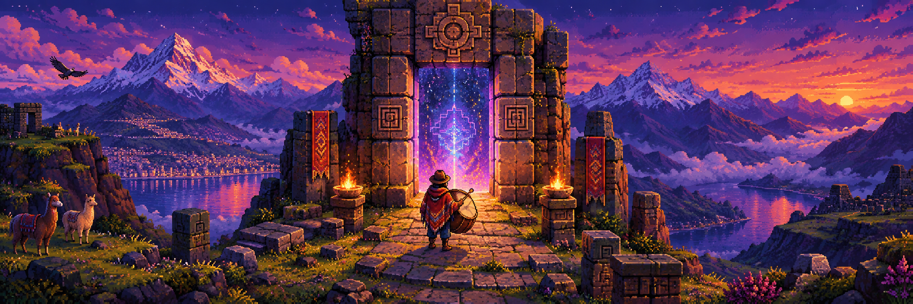

# Kallami: El Eco del Consenso

<!-- Reemplaza este placeholder con una imagen del juego o un banner del proyecto. -->


<p align="center">
	
	
	
</p>

**Kallami: El Eco del Consenso** es un RPG 2D de aventura top-down y un prototipo jugable desarrollado como proyecto académico en Godot Engine 4 con GDScript.

## 🌄 El juego

Inspirado en la leyenda oral boliviana *«Una banda de música devorada por el cerro Kallami»*, de Pucarani, el juego sigue al **Tamborista** en su recorrido por distintos biomas andinos. Para llegar hasta el antiguo Achachila del cerro, deberá reunir ofrendas rituales y superar un encuentro musical que pondrá a prueba su sentido del ritmo.

El objetivo es alcanzar el consenso con el Achachila y liberar a los músicos atrapados, escuchando y respondiendo al eco del cerro.

## 🎮 Mecánicas principales

- **Exploración:** recorre escenarios y biomas andinos, descubre el camino y reúne los elementos necesarios para el ritual.
- **Ofrendas rituales:** encuentra el **Bombo**, la **Coca**, el **Alcohol** y la **Kantuta**.
- **Minijuego de ritmo:** sigue las notas sincronizadas con la banda sonora para enfrentarte al Achachila y alcanzar el consenso.
- **Diálogos y cinemáticas:** descubre la historia mediante escenas y conversaciones integradas en la aventura.

## 🛠️ Arquitectura técnica

- **Autoloads persistentes:** `Global` y `Hud` están configurados como Autoloads en `project.godot`. Este patrón Singleton conserva el estado global, como el inventario y el HUD, al cambiar de escena.
- **Transiciones de nivel seguras:** las solicitudes de cambio que podrían interferir con la física se difieren mediante `call_deferred`.
- **Ritmo sincronizado:** el minijuego utiliza una lógica matemática coordinada con la música para evaluar las entradas del jugador.
- **Diálogo y animación:** nodos `Tween` interpolan la presentación del texto y acompañan las secuencias narrativas.
- **Escenas modulares:** niveles, personajes, objetos recolectables, interfaz y menús están organizados como escenas de Godot.

## 🚀 Instalación y ejecución

### Requisitos

- [Godot Engine 4](https://godotengine.org/download/) (el proyecto declara compatibilidad con Godot 4.7).
- Git, para clonar el repositorio.

### Pasos

1. Clona el repositorio:

	 ```bash
	 git clone <URL_DEL_REPOSITORIO>
	 ```

2. En Godot, selecciona **Importar** y abre el archivo `project.godot` de la carpeta clonada.
3. Espera a que Godot importe los recursos del proyecto.
4. Ejecuta el juego con **Ejecutar proyecto** (F5).

## 📜 Licencia

Este proyecto se distribuye bajo la licencia MIT.
